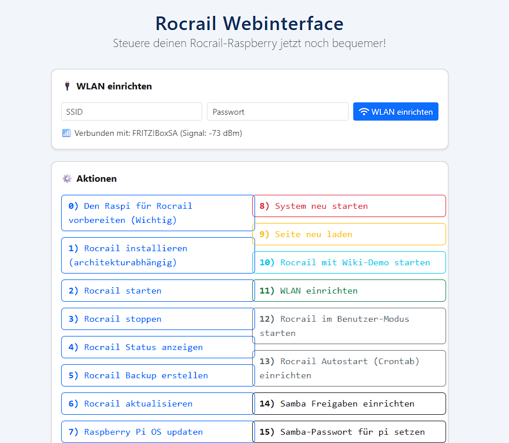

# 📦 Rocrail Raspberry Pi OS Image – Einfach starten, jetzt mit Webinterface

Dieses Projekt stellt ein **fertig vorbereitetes Raspberry Pi OS Lite Image** für den Betrieb von **Rocrail** bereit – **ab Version 1.7** mit moderner Weboberfläche.  
Ziel: Die Einrichtung und Steuerung von Rocrail auf dem Pi soll maximal einfach und komfortabel sein – ohne Linux- oder Terminal-Kenntnisse.

---

[Zum Download des Images](image/README.md)

---

## ✅ Was macht das Image?

- **Raspberry Pi OS Lite (Bookworm)** – kompakt, ohne Desktop
- **Start direkt ins Menü oder Webinterface**: Nach dem ersten Boot erscheint automatisch entweder das klassische Terminal-Menü oder die neue Weboberfläche
- **Webinterface** für die wichtigsten Steuerfunktionen und WLAN-/Samba-Einrichtung (neu ab v1.7)
- Automatische Installation des **Rocrail-Servers** (architekturabhängig)
- **Menüstruktur exakt wie das Originalskript**  
  (inkl. Setup, Installation, WLAN, Backup, Update, Autostart, Samba u.v.m.)
- Unterstützt **32-Bit & 64-Bit Architektur** (automatische Erkennung)
- **Sichere Voreinstellungen** für SSH, Autologin, Netzwerk und Dateizugriffe
- **Vorbereitete sudoers-Einträge** für reibungsloses Arbeiten des Webinterfaces
- **Backup- und Restore-Funktion** per Web oder Menü
- **Individuell anpassbar:** Der komplette Quellcode und die Skripte liegen offen bei

---

## 🖥️ Neu: Das Rocrail Webinterface



Ab Version **1.7** steht ein modernes Webinterface zur Verfügung, erreichbar unter  
`http://rocrail/` oder der IP-Adresse des Raspis im Browser.

**Highlights:**
- Alle Menüpunkte (wie im Originalmenü) als übersichtliche Buttons
- Live-Ausgabe und Statusrückmeldungen (inkl. Fortschrittsanzeige)
- WLAN einrichten, Samba-Freigaben setzen, Backup, Neustart u.v.m. direkt per Klick
- Anzeige und Abfrage, ob Samba installiert ist (Samba-Bereich wird nur bei installierten Paketen angezeigt)
- Automatisches Aktualisieren/Neuladen der Seite (z. B. nach Samba-Installation)
- **Sichere Ausführung:** Systembefehle laufen sauber getrennt per Sudo/Skripte
- Der gewohnte Terminal-Modus bleibt zusätzlich erhalten – perfekt für Power-User

---
## Nutzung ohne Webinterface (Kommandozeile/Bash)

Das Image funktioniert weiterhin **vollständig ohne Webinterface**.  
Das klassische Startmenü **öffnet sich nach Login automatisch** auf dem lokalen Bildschirm oder der SSH Konsole.

> ⚠️ **Hinweis:** Ab Version 1.8 wird die Weiterentwicklung neuer Funktionen auf das **Webinterface** fokussiert. Das Terminal-Menü erhält weiterhin wichtige Bugfixes, aber neue Funktionen wie der automatische Planänderungs-Verlauf (seit 1.8) oder die Backup-Wiederherstellung (seit 1.10) gibt es bisher **nur im Webinterface**. Wer die volle Funktionalität nutzen möchte, sollte das Webinterface bevorzugen.

### Menü manuell öffnen (falls benötigt)

Falls das Menü einmal geschlossen wurde, kann es jederzeit per Konsole wieder geöffnet werden:
```sh
cd ~
./raspi-rocrail-config
```

## 💡 Zielgruppe

- **Modellbahner, die Rocrail auf einem Raspberry Pi als Server nutzen möchten**
- Alle, die eine **Weboberfläche** bevorzugen oder keine Lust auf Terminal haben
- Ideal für Nutzer, die keine Zeit für manuelle Linux-Konfiguration verschwenden möchten
- Auch fortgeschrittene Nutzer, die das System flexibel anpassen wollen

---

## 📥 Installation

1. Lade das passende `.img.xz`-File herunter (32- oder 64-bit)
2. Schreibe das Image **ohne Anpassungen** auf eine SD-Karte (z. B. mit [Raspberry Pi Imager](https://www.raspberrypi.com/software/))
   ⚠️ Wichtig: Im Raspberry Pi Imager **nicht** die Option "OS anpassen" (Zahnrad-Symbol) nutzen, um einen eigenen Benutzernamen, Hostnamen o. ä. zu vergeben! Das Image bringt bereits einen fertig eingerichteten Benutzer `pi` mit, auf den das komplette Menü und Webinterface fest eingestellt sind. Ein abweichender Benutzername führt dazu, dass Skripte und Pfade nicht mehr zusammenpassen und z. B. Rocrail/RocWeb nicht mehr richtig erreichbar ist.
3. Starte den Pi – das Menü **und** das Webinterface sind sofort einsatzbereit
4. Menüpunkt 0 „Ersteinrichtung“ oder direkt per Webinterface loslegen

---

## 🔄 Menü/Webinterface aktualisieren

**Menü und Webinterface lassen sich jederzeit separat aktualisieren, ohne das Image neu zu flashen!**

Ab Version 2.0 geht das direkt im Webinterface: Karte "🔄 Webinterface aktualisieren" → "Auf Updates prüfen". Passiert nur, wenn du es anstößt, kein automatischer Hintergrund-Check. Vor jedem Update wird automatisch der aktuelle Stand gesichert; über "Frühere Version wiederherstellen" lässt sich das jederzeit rückgängig machen.

Alternativ manuell per Git:
```bash
cd ~
git clone https://github.com/OliS2811/raspi-rocrail-config.git
cp raspi-rocrail-config/raspi-rocrail-config ~/
chmod +x ~/raspi-rocrail-config
```
---

## 📝 Hinweise & Anpassungen

- Die Weboberfläche (ab v1.7) basiert auf PHP und Bootstrap, mit Shellskripten im Backend
- Die klassischen Menüskripte sind weiterhin voll funktionsfähig
- **Samba-Optionen** erscheinen im Webinterface nur, wenn Samba installiert ist
- Der Menüpunkt „Seite neu laden“ (Punkt 9) lädt das Webinterface automatisch neu (kein manuelles Aktualisieren nötig)
- Alle wichtigen Skripte werden beim Build automatisch mit den richtigen Rechten ausgestattet
- Das `tmp`-Verzeichnis für temporäre Dateien wird automatisch beim Build angelegt

---

## 🚀 Eigene Anpassungen & Erweiterungen

- Die Menüstruktur ist einfach erweiterbar: eigene Shellskripte können als neue Punkte eingebunden werden
- Das Webinterface ist quelloffen und kann beliebig angepasst werden – Feedback und Pull-Requests sind willkommen!

---

## ⚙️ Technische Details

- **Webserver:** Apache2, PHP8, sudo, curl, ntp (optional)
- **Dateistruktur:**  
  - `/var/www/html/` – Webinterface (HTML, PHP, JS, CSS, Shellskripte)
  - `/usr/local/bin/set_samba_pass.sh` – Hilfsskript für Samba-Passwort-Handling
  - `/etc/sudoers.d/rocrail-web` – Sudo-Regeln für das Webinterface
  - `/home/pi/Rocrail/` – Standard-Arbeitsverzeichnis von Rocrail
- **Image-Build:** basiert auf [pi-gen](https://github.com/RPi-Distro/pi-gen) mit eigenen Stage-Skripten
- **Quellcode:** Vollständig enthalten, inklusive Buildskripten

---

## 📢 Support und Kontakt

Für Rückfragen, Anregungen oder Fehler bitte ein [Issue eröffnen](https://github.com/OliS2811/raspi-rocrail-config/issues)  
Oder direkt per E-Mail an den Maintainer (siehe GitHub-Profil)

---

## 📜 Lizenz

MIT License – freie Nutzung für private Zwecke  
(Siehe LICENSE im Repository)

---

## 🙏 Danksagung

- **Rocrail** – Open-Source Modellbahnsteuerung
- Allen Testern, Bugmeldern und Ideen-Gebern in der Community!

---

**Viel Spaß beim Steuern deiner Modellbahn mit Rocrail!** 🚂

---

Oliver S., 2025  
[https://github.com/OliS2811/raspi-rocrail-config](https://github.com/OliS2811/raspi-rocrail-config)
